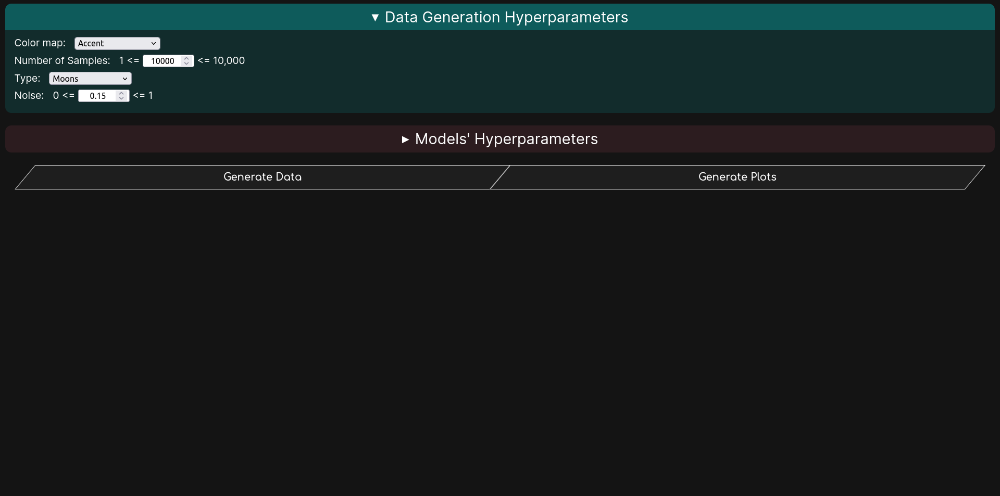
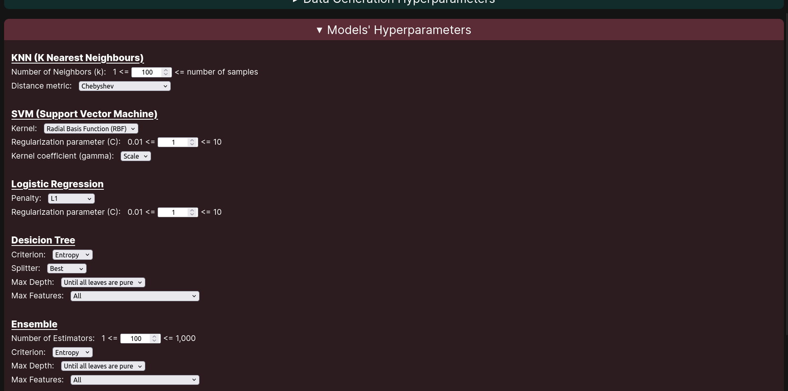
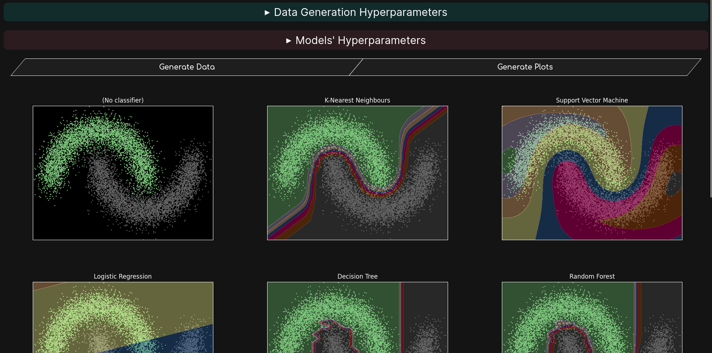
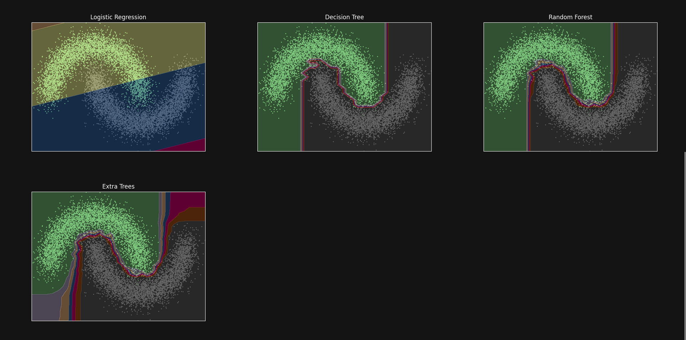

<div align="center">

<!-- https://coolors.co/gradient-palette/f72585-066da5?number=3 -->

[](https://github.com/msr8/classification)
[](https://github.com/msr8/classification)
[](https://github.com/msr8/classification)






</div>


<br><hr><br>


# Introduction

- Designed a web platform enabling users to interactively **manipulate data generation processes and model hyperparameters**, with visual feedback of the outcomes
- Demonstrated knowledge and proficiency in the inner workings of **various classification algorithms**
- Utilized **Matplotlib** for plotting the data and visualizing the decision boundaries
- Developed an API using **Flask** to facilitate plot generation
- Implemented thorough **error validation mechanisms**
- Deployed the website using **PythonAnywhere**

<br>

### Techstack
- Python
- Flask
- Scikit-learn
- Matplotlib
- HTML+CSS+JS


<br><hr><br>


# Running the website
First of all, ensure that [git](https://git-scm.com/downloads) and [python](https://www.python.org/downloads/) are installed on your system. Then run the following commands:

```bash
git clone https://github.com/msr8/classification
cd classification
pip install -r requirements.txt
python main.py
```

And voila, the website should be up and running on `http://127.0.0.1:8000`